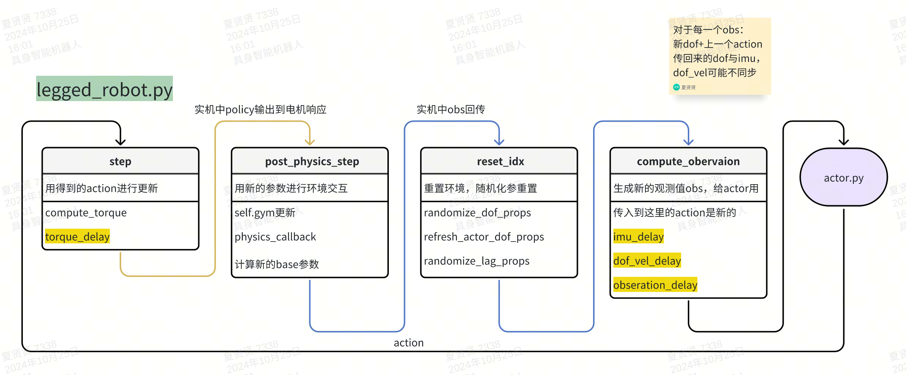
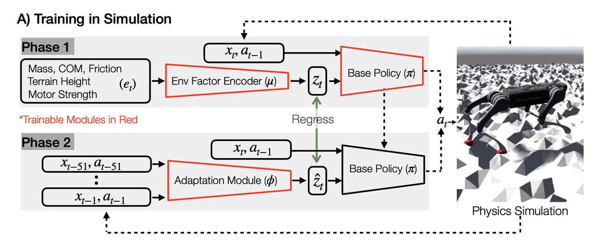
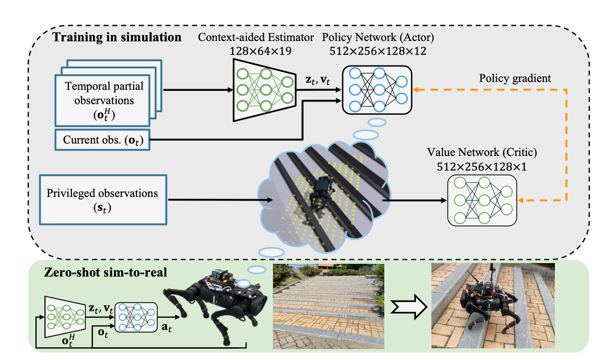
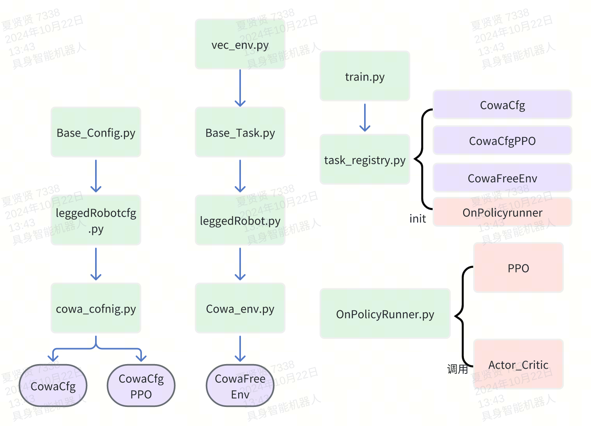

# humanoid
## TODO
* [x] 优化状态估计器的训练（逐步增加估计速度的比例）
* [x] 添加teacher-student框架
## Features

#### 1, randomization
在leggedrobot.py中添加了randomization，可以通过config中domainrand来进行设置。
#### 2, Delay
在leggedrobot.py中根据实机sim2real需求添加了action_delay，obs_delay，dof_vel_delay，imu_delay，torque_delay，的实现具体作用时间段如图。


#### 3, RMA


采用论文中的架构：

- 先用privileged_obs中想要预测的内容输入到expert_encoder中，得到一个latent_pri，在训练时把这个latent_pri cat上obs输入到policy中进行训练，得到一个特权policy。
- 然后用历史的obs输入到adaptation_encoder中，得到一个latent_est，在训练时用这个latent_est和latent_pri做loss，得到一个可以用历史obs预测privileged_obs的encoder。在部署推理时使用adaptation_encoder。（留了两个接口，一个act_expert，一个act_student，分别在train和play的时候使用）
- critic网络的输入是privileged_obs，没有latent_pri，不能干扰critic网络的训练。

特性：

- 输入给adaptation_encoder的历史obs不能太少，不然很难学到有效的信息
- 最好采用一次policy更新训练多次adaptation_encoder的方式，预测的mlp收敛比较慢，可以调节config中的num_adaptation_module_substeps来实现
- adaptation_encoder得到的这个latent并不能代表具体的观察数值，但是latent会更倾向于与privileged_obs的latent相似，也就是说与假如DreamWaq中的VAEdecoder出来的东西与privileged_obs做loss，那么RMA与DreamWaq做的事情是一样的，但是DreamWaq会更显式相关，并且可以从encoder中取部分用于预测真实观测。

使用：

- 直接task切换到cowa_rma，超参参考cowa_rma_config。
- actor_input_stack控制输入到actor中的历史个数
- c_frame_stack控制输入到critic中的历史个数。
- frame_stack控制输入到adaptation_encoder中的历史数据个数。
- 输入到expert_encoder中的privileged_obs个数默认是1（最好也是1）。
- adaptation_module_learning_rate控制adaptation_encoder的学习率。
- num_adaptation_module_substeps，控制每次actor更新训练几次adaptation_encoder


#### 4, Estimator
实现了两种不同的状态估计器，**分别为基于VAE的历史latent与速度vel估计其与基于MLP的速度vel估计器**。
可以通过指定不同的task来进行切换。
##### 4.1 VAE

采用论文中的架构：
  - 输入历史观测信息到encoder中获得一个latent，从latent中解码出一个vel，cat obs与latent还有vel输入到policy中进行训练。
  - 用预测到的vel与真实vel做一个vel_loss，用decoder对latent进行decode然后与next_observation做一个latent_loss，两个loss加起来更新encoder。

特性：
  - 可以从latent中预测真实的base_vel，同样的可以扩展到其他观测项。
  - 论文中用next_observation来更新encoder主要是为了满足‘世界模型’的叙事需要，可以尝试使用privileged_obs来做loss可能会合理很多。
  
使用：
  - 直接--task=cowa_vae切换到cowa_vae。超参在里面有定义
##### 4.2 Estimator
使用MLP对真实参数进行预测，estimator会接受obs_history，预测需要的值，这里实现了base_vel的预测，目前效果还不错。
特性：
  - estimator独自更新，不参与actor的更新，但是也可以输入预测的值。
  
使用：
  - --task=cowa_est切换到estimator。
  - 使用了privlegde_obs中最后几项做loss，可以将想要预测的值放到privlegde_obs中，然后修改estimator中的loss_fn即可。
  - 可以在ppo与OnPolicyRunnerEstimator中修改是否把预测的值作为输入，这里推荐如果使用预测的值，则frame_stack最好不要大，不然训练很难收敛。
  - 可以更改ppo中的loss_fn的输入来更改要预测的观测值，默认是base_vel。
###  5,web_visualizer
用于在没有gui的情况下，可视化训练过程，可以查看训练过程中途查看步态与训练状态。
安装使用：
（这里用于安装依赖）：
`pip install sim_web_visualizer`
`pip install meshcat`
手动启动：
`python -m meshcat.servers.zmqserver`

实现：
在legged_gym.py的create_sim中
sim-web-visualizer：
- 首先用create_isaac_visualizer创建一个MeshCatVisualizerIsaac类
- 然后使用bind_visualizer_to_gym读取已经创建的gym和sim，
- 使用set_gym_instance对gym和sim进行操作，将meshcat可视化需要的函数给bind上去，这样就可以随着sim的更新进行更新。
self.original_gym = 输入的gym
self.sim = 输入的sim

性能测试：
使用visualizer会对训练性能产生影响，具体影响大致如下：
2048个envs
1. （4个robot）web &  isaacvis(stopped)：18000 
2. （4个robot）without web &  isaacvis(stopped)：25000 
3. （4个robot）web & without isaacvis：19000 
4. （1个robot）web & without isaacvis ：22000
## 代码结构
以下为代码结构的大致解释，可以用作理解参考。
在运行train.py之后会以下面流程运行：
`train.py---task_registry.py---on_policy_runner.py---cowa\_config.py---cowa\_env.py`
train.py的顺序(以VAE为例子)：
1. 首先会读取task名称，在#./envs/\_\_init\_\_.py中注册的，实例化了CowaFreeEnv, CowaCfg(), CowaCfgPPO_VAE())
2. make_alg_runner根据CowaCfgPPO_VAE()中定义的runner_class_name, policy_class_name, algorithm_class_name从各个文件读取相的类并实例化。主要是onpolicyrunnerVAE

#### 1, algo文件夹：

```plain&#x20;text
on_policy_runner.py
保存强化学习ppo算法 
调用cowa_env.py获取obs与obs_critic。
调用ppo.py初始化两个模型，一个act一个actor_critic ，critic有更多的参数用作第一个的监督。输入obs得到两个act 
调用cowa_env.py的step获得新的obs与obs_critic，得到reward与其他参数
```

```plain&#x20;text
ppo.py
实例化模型actor_critic,输入observation得到action
用update来更新网络
```

```python
actor_critic.py
定义了actor，critic网络，实例化了vae，mlp（若有）。
act中定义了输入
```

#### 2, envs文件夹：

```plain&#x20;text
base/logged_robot.py
包含了bot在isaac环境中的交互方式，各种策略
包含了step，得到action后step来更新新的状态
包含了compute_reward，用来计算reward
```

```plain&#x20;text
cowa_config.py
定义了urdf的路径用于bot读取。
定义了训练的issac环境参数。
定义了奖励scale用于管理奖励。
定义了超参数可以在这里设置。
```

```plain&#x20;text
config_env.py
定义了如何计算observation与reward
定义了step，调用了base/legged_robot中的step用来更改电机的状态。
```

#### 3, utils文件夹：

```plain&#x20;text
terrain.py:使用了Isaac Gym用来初始化地形
task_registry.py:被train.py调用，包含了两个make_env与make_alg_runner用来读取confg初始化环境与算法
```

#### 4, scripts文件夹：内涵执行脚本

```plain&#x20;text
train.py:调用task_registry创建环境与算法，调用on_pilicy_runner开始训练。
```

